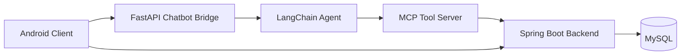

# MobileCA

GDipSA 62 Mobile App Group 3 project.

## Overview

MobileCA is a mobile wellness application built around three cooperating layers:

- An Android client for user interaction, local chat context, and dashboards
- A Spring Boot backend for authentication, business logic, and persistence
- A Python FastAPI + MCP chatbot bridge for orchestration, tool-calling, and AI-assisted wellness flows

The app supports user authentication, wellness logging, dashboard summaries, profile and goal management, recommendation history, and a chatbot that can read data, log data, and perform wellness-oriented web lookups.

## Quick Start (Recommended)

After cloning the repository:

1. Install prerequisites:
	Java 21, Python 3, Android Studio / Android SDK, and MySQL.
2. Create local machine config:
	- Copy `client/local.properties.example` to `client/local.properties`.
	- `client/local.properties` should contain your own `sdk.dir` and optional overrides for:
	  - `SPRING_BASE_URL`
	  - `WELLNESS_AGENT_BASE_URL`
	  - `OPENROUTER_API_KEY`
	- Copy `server/mcp_server/.env.example` to `server/mcp_server/.env`.
	- `server/mcp_server/.env` should define your own `OPENROUTER_API_KEY`.
	- Spring backend environment should define `JWT_SECRET` and, if needed, `MYSQL_USERNAME` and `MYSQL_PASSWORD`.
3. Start services:
	- Spring Boot on port `8000`
	- FastAPI bridge on port `8001`
4. Launch the Android app from Android Studio or the VS Code tasks.

Example `client/local.properties` additions:

```properties
sdk.dir=C\:/Users/yourname/AppData/Local/Android/Sdk
SPRING_BASE_URL=http://10.0.2.2:8000/
WELLNESS_AGENT_BASE_URL=http://10.0.2.2:8001/
OPENROUTER_API_KEY=
```

For a physical Android device, replace `10.0.2.2` with your laptop's LAN IP and ensure the device can reach that host.

Example `server/mcp_server/.env`:

```dotenv
OPENROUTER_API_KEY=
LOG_LEVEL=INFO
SPRING_BOOT_BASE_URL=http://localhost:8000
```


## Architecture



### Runtime Responsibilities

- [client](client)
	Android application. Handles UI, local vector retrieval, local chat history, authenticated REST calls to Spring Boot, and backend-first chatbot requests to FastAPI.
- [server](server)
	Spring Boot application. Owns user authentication, persistence, wellness domain logic, dashboards, profile/goals, and recommendation APIs.
- [server/mcp_server](server/mcp_server)
	Python chatbot bridge and MCP tool server. Owns chat orchestration, request-local JWT forwarding, deterministic logging/read flows, and tool access to Spring APIs.
- [objectbox-generator](objectbox-generator)
	Supporting utilities and data tooling for ObjectBox and RAG-related workflows.

## Repository Structure

- [client](client)
	Android app source, resources, Gradle configuration, and ObjectBox integration.
- [server](server)
	Spring Boot backend, MCP bridge, Python chatbot tests, and SQL seed/config resources.
- [objectbox-generator](objectbox-generator)
	Experimental/support tooling for ObjectBox and data generation.

## Main Features

- User registration, login, and logout with JWT authentication
- Wellness record capture for:
	sleep, food, hydration, exercise, mood, and weight
- Dashboard views for:
	daily summary, date-range metrics, badge progress, hourly summaries, and activity history
- User profile read/update
- User goal read/update
- Recommendation generation and history
- Notification polling with Android WorkManager
- Chatbot with backend-assisted logging, reading, recommendation, and wellness lookup flows
- Client-side fallback chatbot when the backend bridge is unavailable for non-persistence queries

## Tech Stack

### Android Client

- Kotlin
- Android SDK / AndroidX
- Navigation Component
- Retrofit + OkHttp + Gson
- Kotlin coroutines
- WorkManager
- ObjectBox
- ONNX Runtime
- MPAndroidChart

### Spring Backend

- Java 17 runtime
- Spring Boot 4.1
- Spring Web
- Spring Security
- Spring Data JPA
- MySQL
- JWT via `jjwt`
- Spring AI dependencies for OpenAI/OpenRouter and Chroma integration
- Lombok

### MCP / Chatbot Layer

- Python
- FastAPI
- Uvicorn
- LangChain
- LangChain OpenAI adapter
- LangChain MCP adapters
- MCP Python SDK (`mcp.server.fastmcp`)
- HTTPX
- DDGS web search

## Chatbot and MCP Implementation

The chatbot is not a direct Android-to-LLM integration. It is a layered system designed for authenticated, tool-backed wellness workflows.

### High-Level Chat Flow

```
Request
│
▼
Active logging draft? ──Yes──► Continue deterministic logging flow (terminal)
│ No
▼
New logging intent detected? ──Yes──► Start deterministic logging flow (terminal)
│ No
▼
LLM stage (LangChain agent + MCP tools)
│
├─ Reads wellness data (daily summary, exercise history, recommendations) via tools
├─ Performs wellness/nutrition web search via a tool
└─ Domain scope, tone, and length are enforced by the system prompt,
not by a separate deterministic pre-check
```

1. The user sends a message from the Android chat screen.
2. The client gathers: recent messages, relevant past messages (found via on-device semantic search over chat history), and optional local dish-vector context.
3. If backend mode is enabled, the client sends the request to the FastAPI bridge at `http://10.0.2.2:8001/api/chat`.
4. FastAPI stores the JWT token in request-local context so downstream Spring API calls remain user-scoped.
5. FastAPI checks, in order: (a) whether an active logging draft already exists for this user, and (b) if not, whether the message looks like a new logging intent. Either check routes the request into a deterministic, multi-turn logging state machine, and the LLM is never called for that turn.
6. If neither check applies, the request goes to a LangChain agent (via OpenRouter), which decides on its own whether to call an MCP tool — reading wellness data, fetching a recommendation, or performing a web search — before composing an answer.
7. MCP tools call Spring Boot APIs on `http://localhost:8000` using the forwarded JWT.
8. The bridge applies output safeguards (avoiding echoed replies and correcting false refusals when a tool call actually succeeded) and returns a single answer string to Android.

### Client-Side Fallback

The client has an explicit fallback path in [client/app/src/main/java/sg/edu/nus/iss/client/chatbot/RagRepository.kt](client/app/src/main/java/sg/edu/nus/iss/client/chatbot/RagRepository.kt):

- If backend chat is unavailable, general wellness questions fall back to a local OpenRouter prompt flow.
- The local fallback can use:
	local dish vector retrieval and locally persisted chat history.
- Logging requests do not fall back to fake persistence.
	If the backend is unavailable, the app tells the user it cannot save the wellness log right now.

### FastAPI Agent Responsibilities

The FastAPI entrypoint is [server/mcp_server/mcp_agent_wellness.py](server/mcp_server/mcp_agent_wellness.py). It owns:

- `/api/chat` chatbot endpoint
- `/api/tools` health/debug endpoint
- deterministic orchestration before LLM fallback
- multi-turn draft state for partial wellness logs
- request-local JWT propagation
- output cleanup for tool results and model responses

### MCP Tool Server Responsibilities

The MCP tool server is [server/mcp_server/mcp_server_wellness.py](server/mcp_server/mcp_server_wellness.py). It exposes tool semantics over stdio and acts as the server-side source of truth for:

- validation and required-field checks
- meal and exercise enum normalization
- logging payload construction
- daily summary retrieval
- exercise history retrieval
- latest recommendation retrieval
- personalized recommendation generation, combining user goals, daily summary, and a profile-guided web search fallback when no goals are set
- wellness-oriented web search

The tool server is launched over stdio by the FastAPI layer through `MultiServerMCPClient`, not via a separate network API.

### Current MCP Tool Categories

The chatbot can currently:

- Log wellness data into the backend database
	food, hydration, weight, mood, sleep, exercise
- Query wellness data from the backend database
	daily summary, exercise history, latest recommendation, personalized recommendation
- Perform wellness and nutrition web search
	calorie lookups, nutrition facts, general wellness information
- Combine estimation and logging
	for example estimate calories first, then log after confirmation
- Provide general wellness chat responses
	with client fallback when the bridge is unavailable

### Authentication Flow for MCP Calls

- Android sends the same bearer token used for normal backend-authenticated requests.
- FastAPI stores that token using [server/mcp_server/jwt_context.py](server/mcp_server/jwt_context.py).
- MCP tools forward the token to Spring through [server/mcp_server/spring_boot_client.py](server/mcp_server/spring_boot_client.py).
- Spring remains the system of record for all real user-specific reads and writes.

## API Summary

### Spring Boot Backend APIs

Implemented under [server/src/main/java/sg/edu/nus/features](server/src/main/java/sg/edu/nus/features).

#### Auth

- `POST /api/auth/register`
- `POST /api/auth/login`
- `POST /api/auth/logout`

#### Wellness

- `POST /api/wellness/records`
- `GET /api/wellness/daily-summary`
- `GET /api/wellness/exercise-logs`
- `DELETE /api/wellness/exercise-logs/{id}`
- `GET /api/wellness/hourly-summary`
- `GET /api/wellness/badge-progress`
- `POST /api/wellness/reset-today`
- `GET /api/wellness/recommendations`

#### User

- `GET /api/user/goals`
- `GET /api/user/goals/raw`
- `PUT /api/user/goals/{goalType}`
- `GET /api/user/profile`
- `PUT /api/user/profile`

### FastAPI Chatbot Bridge APIs

- `POST /api/chat`
- `GET /api/tools`
- `GET /api/recommendations`

The FastAPI bridge runs on port `8001` and is separate from the Spring backend on port `8000`.

### Team Setup Notes

- VS Code tasks assume `python` is available on PATH rather than a machine-specific install path.
- Android SDK/JDK paths must stay local to each machine in `client/local.properties`.
- Client base URLs are now configurable through `client/local.properties` instead of being fixed in source code.
- Spring defaults to `localhost:3306` for MySQL and FastAPI defaults to calling Spring at `http://localhost:8000` unless overridden by environment variables.
- Commit only the `*.example` config files; keep real machine-specific and secret-bearing files local.

## Configuration

### Spring Boot Configuration

Primary file:
[server/src/main/resources/application.properties](server/src/main/resources/application.properties)

Important defaults:

- Spring server port: `8000`
- Spring server bind address: `0.0.0.0`
- MySQL database: `wellness_db`
- MySQL username: `${MYSQL_USERNAME:root}`
- MySQL password: `${MYSQL_PASSWORD:}`
- JWT secret: `${JWT_SECRET}`
- OpenRouter key for Spring AI: `${OPENROUTER_API_KEY}`
- Active profile: `local`

### MCP / FastAPI Configuration

Relevant files:

- [server/mcp_server/mcp_agent_wellness.py](server/mcp_server/mcp_agent_wellness.py)
- [server/mcp_server/mcp_server_wellness.py](server/mcp_server/mcp_server_wellness.py)
- [server/mcp_server/spring_boot_client.py](server/mcp_server/spring_boot_client.py)
- [server/mcp_server/.env](server/mcp_server/.env)

Important notes:

- FastAPI bridge runs on port `8001`.
- MCP tools call Spring using `http://localhost:8000`.
- `OPENROUTER_API_KEY` is loaded by the bridge from `server/mcp_server/.env` when present.

### Android Client Configuration

Relevant files:

- [client/app/src/main/java/sg/edu/nus/iss/client/network/RetrofitClient.kt](client/app/src/main/java/sg/edu/nus/iss/client/network/RetrofitClient.kt)
- [client/app/src/main/java/sg/edu/nus/iss/client/backend/BackendConfig.kt](client/app/src/main/java/sg/edu/nus/iss/client/backend/BackendConfig.kt)
- [client/app/build.gradle.kts](client/app/build.gradle.kts)

Current defaults:

- Spring REST base URL for the emulator: `http://10.0.2.2:8000/`
- FastAPI chat bridge base URL for the emulator: `http://10.0.2.2:8001/`
- Backend chatbot mode is enabled with `BackendConfig.USE_BACKEND = true`
- Optional client-side OpenRouter key can be provided via `OPENROUTER_API_KEY` in `client/local.properties`

## Prerequisites

- JDK 21 for Android build/tooling
- JDK 17 for Spring Boot runtime compatibility
- Python 3.14 or equivalent Python environment for the FastAPI chatbot bridge and tests
- Android Studio or Android SDK + emulator/device
- Local MySQL instance
- Maven Wrapper and Gradle Wrapper are already included

## Running the Project

### 1. Start MySQL

Ensure a local MySQL instance is running and accessible to the Spring datasource in [server/src/main/resources/application.properties](server/src/main/resources/application.properties).

### 2. Start Spring Boot Backend

From [server](server):

#### Windows

```powershell
.\mvnw.cmd spring-boot:run
```

#### macOS/Linux

```bash
./mvnw spring-boot:run
```

Backend default port: `8000`

### 3. Start FastAPI Chatbot Bridge

From the repository root or a Python environment that can import the bridge package:

#### Windows

```powershell
C:/Python314/python.exe -m uvicorn mcp_agent_wellness:app --app-dir "C:/Users/ameli/Documents/GDipSA/CAs/MobileCA/server/mcp_server" --host 0.0.0.0 --port 8001
```

#### macOS/Linux

```bash
python -m uvicorn mcp_agent_wellness:app --app-dir ./server/mcp_server --host 0.0.0.0 --port 8001
```

Bridge default port: `8001`

### 4. Start Android Client

From [client](client):

#### Windows

```powershell
.\gradlew.bat assembleDebug
```

#### macOS/Linux

```bash
./gradlew assembleDebug
```

Then run the app from Android Studio or install the debug build onto an emulator/device.

## VS Code Tasks

Task definitions live in [.vscode/tasks.json](.vscode/tasks.json).

Available task groups:

- `Start Spring Backend`
- `Stop Spring Backend`
- `Start Chat Stack`
- `Stop Chat Stack`
- `Start Full Stack`
- `Stop Full Stack`

- `Start FastAPI Chatbot Bridge`
- `Stop FastAPI Chatbot Bridge`
- `Install Chatbot Test Dependencies`
- `Run Chatbot API Tests`
- `Test Chatbot API (Install + Run)`

Note: the current VS Code tasks are pinned to `C:/Python314/python.exe`. Update [.vscode/tasks.json](.vscode/tasks.json) if your local Python path is different.

## Testing

### Python Chatbot Tests

The chatbot regression suite lives under [server/mcp_server/tests](server/mcp_server/tests).

Run manually:

```powershell
C:/Python314/python.exe -m pip install -r server/mcp_server/requirements.txt -r server/mcp_server/requirements-dev.txt
C:/Python314/python.exe -m pytest server/mcp_server/tests -q
```

Or use the VS Code task:

- `Test Chatbot API (Install + Run)`

### Android / Server Tests

This repository is primarily wired for Android builds and Python chatbot tests from VS Code. Additional Spring and Android test workflows can be run through the usual Maven/Gradle commands if extended by the team.

## Chatbot Query Types

The chatbot currently supports these major query categories:

- Logging to the backend database
	water, weight, mood, sleep, food, exercise
- Reading from the backend database
	daily summary, recent activity/exercise history, latest recommendation
- Wellness and nutrition web search
	calorie or nutrition lookups, general wellness information
- Hybrid search-and-log flows
	estimate or search first, then confirm and save
- General wellness conversation
	advice and follow-up chat, with client fallback when backend chat is unavailable

## Recommendation and Notification Flow

- Spring exposes recommendation APIs under `/api/wellness/recommendations`
- The Android client checks recommendations from the home/dashboard flow
- The app also polls in the background using WorkManager
- New recommendations update the unread indicator and notification history UI

Relevant client files:

- [client/app/src/main/java/sg/edu/nus/iss/client/dashboard/HomeFragment.kt](client/app/src/main/java/sg/edu/nus/iss/client/dashboard/HomeFragment.kt)
- [client/app/src/main/java/sg/edu/nus/iss/client/dashboard/RecommendationPollWorker.kt](client/app/src/main/java/sg/edu/nus/iss/client/dashboard/RecommendationPollWorker.kt)
- [client/app/src/main/java/sg/edu/nus/iss/client/dashboard/RecommendationHistoryFragment.kt](client/app/src/main/java/sg/edu/nus/iss/client/dashboard/RecommendationHistoryFragment.kt)
- [client/app/src/main/java/sg/edu/nus/iss/client/util/SessionManager.kt](client/app/src/main/java/sg/edu/nus/iss/client/util/SessionManager.kt)

## Seed Data and Test Accounts

Initial SQL seed data is in [server/src/main/resources/data.sql](server/src/main/resources/data.sql).

The sample seed password documented there is:

- `Password@123`

Example seed users are also defined in the same SQL file.

## Important Notes

- The Android client and Spring backend are the main production application layers.
- The FastAPI + MCP layer is currently a bridge/orchestration service for chatbot functionality.
- This repository also includes experimental/support assets under [objectbox-generator](objectbox-generator) and [server/src/RAG](server/src/RAG).
- The Chroma-related Spring AI dependency is present, but Chroma auto-configuration is currently disabled in [server/src/main/resources/application.properties](server/src/main/resources/application.properties).
